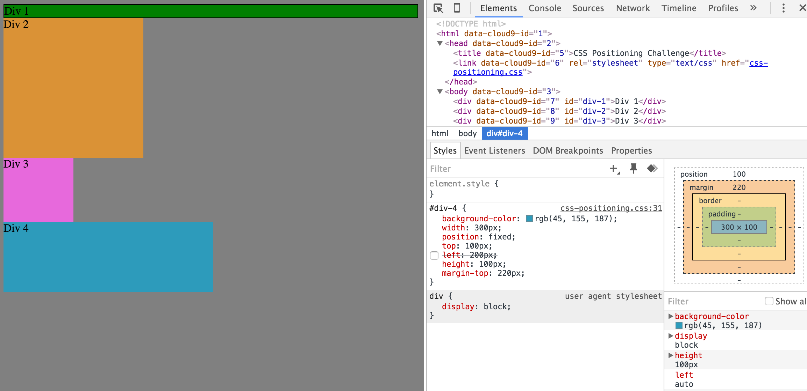

# 1. Change the Colors

# 2. Column

# 3. Row

# 4. Make Equidistant

# 5. Squares

# 6. Make Footer

# 7. Header

# 8. Side Bar

# 9. Get Creative

# How can you use Chrome's DevTools inspector to help you format or position elements?
Chrome's DevTools give the users the ability inspect every html element and its corresponding CSS attribute. By targetting each element, the user has the ability to adjust anything to their liking...down to the position/color pixel.

# How can you resize elements on the DOM using CSS?
First the user will have to find the specific tag of the element - this could be a semantic tag, class, or even an id tag. Then, one way the user can adjust the height and width pixels in CSS.

# What are the differences between absolute, fixed, static, and relative positioning?
Absolute - The element is positioned relative to its first positioned (not static) ancestor element.

Fixed - The element is positioned relative to the browser window.

Static - Default value. Elements render in order, as they appear in the document flow.

Relative - The element is positioned relative to its normal position.

# Which did you find easiest to use? Which was most difficult?
The difference between positioning was difficult to understand because we were changing several elements at the same time. What my pair and I did was to eliminate the variations between CSS attribute of the blocks, then tested what each of the positioning meant.

# What are the differences between margin, border, and padding?
Margin - Clears an area outside the border. The margin is transparent.
Border - A border that goes around the padding and content.
Padding - Clears an area around the content. The padding is transparent.

# What was your impression of this challenge overall? (love, hate, and why?)
I think it was a good challenge. To effectively create our own pages, we'll have to understand these basics. I think the frustrating thing is seeing how each piece would affect the display behavior on screen takes trial and error. Since there are so many, sometimes you're not sure about finding the right one to use.