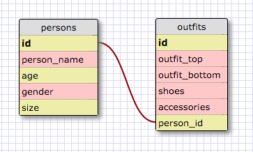

# 1. Select all data for all states.

sqlite> SELECT * FROM states;

id          state_name  population_density  population  region_id
----------  ----------  ------------------  ----------  ----------
1           Alabama     96.45               4822023     5
2           Alaska      1.1111              731449      10
3           Arizona     57.05               6553255     8
4           Arkansas    56.43               2949131     7
5           California  244.2               38041430    9
6           Colorado    49.33               5187582     8
7           Connecticu  741.4               3590347     1
8           Delaware    470.7               917092      3
9           Florida     360.2               19317568    3
10          Georgia     172.5               9919945     3
11          Hawaii      216.8               1392313     11
12          Idaho       19.15               1595728     8
13          Illinois    231.9               12875255    4
14          Indiana     182.5               6537334     4
15          Iowa        54.81               3074186     6
16          Kansas      35.09               2885905     6
17          Kentucky    110.0               4380415     5
18          Louisiana   105.0               4601893     7
19          Maine       43.04               1329192     1
20          Maryland    606.2               5884563     3
21          Massachuse  852.1               6646144     1
22          Michigan    174.8               9883360     4
23          Minnesota   67.14               5379139     6
24          Mississipp  63.5                2984926     5
25          Missouri    87.26               6021988     6
26          Montana     6.86                1005141     8
27          Nebraska    23.97               1855525     6
28          Nevada      24.8                2758931     8
29          New Hampsh  147.0               1320718     1
30          New Jersey  1205.0              8864590     2
31          New Mexico  17.16               2085538     8
32          New York    415.3               19570261    2
33          North Caro  200.6               9752073     3
34          North Dako  9.92                699628      6
35          Ohio        282.5               11544225    4
36          Oklahoma    55.22               3814820     7
37          Oregon      40.33               3899353     9
38          Pennsylvan  285.3               12763536    2
39          Rhode Isla  1016.0              1050292     1
40          South Caro  157.1               4723723     3
41          South Dako  10.86               833354      6
42          Tennessee   156.6               6456243     5
43          Texas       98.07               26059203    7
44          Utah        34.3                2855287     8
45          Vermont     67.73               626011      1
46          Virginia    207.3               8185867     3
47          Washington  102.6               6724540     9
48          Washington  10357.0             632323      3
49          West Virgi  77.06               1855413     3
50          Wisconsin   105.2               5726398     4
51          Wyoming     5.851               576412      8

# 2. Select all data for all regions.

sqlite> SELECT * FROM regions;

id          region_name
----------  -----------
1           New England
2           Mid-Atlanti
3           South Atlan
4           East North
5           East South
6           West North
7           West South
8           Mountain
9           Pacific
10          North Pacif
11          Tropical Pa

# 3. Select all state_name and population for all states.

qlite> SELECT state_name, population FROM states;

state_name  population
----------  ----------
Alabama     4822023
Alaska      731449
Arizona     6553255
Arkansas    2949131
California  38041430
Colorado    5187582
Connecticu  3590347
Delaware    917092
Florida     19317568
Georgia     9919945
Hawaii      1392313
Idaho       1595728
Illinois    12875255
Indiana     6537334
Iowa        3074186
Kansas      2885905
Kentucky    4380415
Louisiana   4601893
Maine       1329192
Maryland    5884563
Massachuse  6646144
Michigan    9883360
Minnesota   5379139
Mississipp  2984926
Missouri    6021988
Montana     1005141
Nebraska    1855525
Nevada      2758931
New Hampsh  1320718
New Jersey  8864590
New Mexico  2085538
New York    19570261
North Caro  9752073
North Dako  699628
Ohio        11544225
Oklahoma    3814820
Oregon      3899353
Pennsylvan  12763536
Rhode Isla  1050292
South Caro  4723723
South Dako  833354
Tennessee   6456243
Texas       26059203
Utah        2855287
Vermont     626011
Virginia    8185867
Washington  6724540
Washington  632323
West Virgi  1855413
Wisconsin   5726398
Wyoming     576412

# 4. Select the state_name and population for all states ordered by population. The state with the highest population should be at the top.

sqlite> SELECT state_name, population FROM states ORDER BY population DESC;

state_name  population
----------  ----------
California  38041430
Texas       26059203
New York    19570261
Florida     19317568
Illinois    12875255
Pennsylvan  12763536
Ohio        11544225
Georgia     9919945
Michigan    9883360
North Caro  9752073
New Jersey  8864590
Virginia    8185867
Washington  6724540
Massachuse  6646144
Arizona     6553255
Indiana     6537334
Tennessee   6456243
Missouri    6021988
Maryland    5884563
Wisconsin   5726398
Minnesota   5379139
Colorado    5187582
Alabama     4822023
South Caro  4723723
Louisiana   4601893
Kentucky    4380415
Oregon      3899353
Oklahoma    3814820
Connecticu  3590347
Iowa        3074186
Mississipp  2984926
Arkansas    2949131
Kansas      2885905
Utah        2855287
Nevada      2758931
New Mexico  2085538
Nebraska    1855525
West Virgi  1855413
Idaho       1595728
Hawaii      1392313
Maine       1329192
New Hampsh  1320718
Rhode Isla  1050292
Montana     1005141
Delaware    917092
South Dako  833354
Alaska      731449
North Dako  699628
Washington  632323
Vermont     626011
Wyoming     576412

#5. Select the state_name for the states in region 7.

sqlite> SELECT state_name FROM states WHERE region_id IN (7);

state_name
----------
Arkansas
Louisiana
Oklahoma
Texas

#6. Select the state_name and population_density for states with a population density over 50 ordered from least to most dense.

sqlite> SELECT state_name, population_density FROM states WHERE population_density > 50 ORDER BY population_density ASC;
state_name  population_density
----------  ------------------
Iowa        54.81
Oklahoma    55.22
Arkansas    56.43
Arizona     57.05
Mississipp  63.5
Minnesota   67.14
Vermont     67.73
West Virgi  77.06
Missouri    87.26
Alabama     96.45
Texas       98.07
Washington  102.6
Louisiana   105.0
Wisconsin   105.2
Kentucky    110.0
New Hampsh  147.0
Tennessee   156.6
South Caro  157.1
Georgia     172.5
Michigan    174.8
Indiana     182.5
North Caro  200.6
Virginia    207.3
Hawaii      216.8
Illinois    231.9
California  244.2
Ohio        282.5
Pennsylvan  285.3
Florida     360.2
New York    415.3
Delaware    470.7
Maryland    606.2
Connecticu  741.4
Massachuse  852.1
Rhode Isla  1016.0
New Jersey  1205.0
Washington  10357.0

7. Select the state_name for states with a population between 1 million and 1.5 million people.

sqlite> SELECT state_name FROM states WHERE population BETWEEN 1000000 AND 1500000;
state_name
----------
Hawaii
Maine
Montana
New Hampsh
Rhode Isla

8. Select the state_name and region_id for states ordered by region in ascending order.

sqlite> SELECT state_name, region_id FROM states ORDER BY region_id ASC;

state_name   region_id
-----------  ----------
Connecticut  1
Maine        1
Massachuset  1
New Hampshi  1
Rhode Islan  1
Vermont      1
New Jersey   2
New York     2
Pennsylvani  2
Delaware     3
Florida      3
Georgia      3
Maryland     3
North Carol  3
South Carol  3
Virginia     3
Washington,  3
West Virgin  3
Illinois     4
Indiana      4
Michigan     4
Ohio         4
Wisconsin    4
Alabama      5
Kentucky     5
Mississippi  5
Tennessee    5
Iowa         6
Kansas       6
Minnesota    6
Missouri     6
Nebraska     6
North Dakot  6
South Dakot  6
Arkansas     7
Louisiana    7
Oklahoma     7
Texas        7
Arizona      8
Colorado     8
Idaho        8
Montana      8
Nevada       8
New Mexico   8
Utah         8
Wyoming      8
California   9
Oregon       9
Washington   9
Alaska       10
Hawaii       11

9. Select the region_name for the regions with "Central" in the name.

sqlite> SELECT regions.region_name FROM regions WHERE region_name LIKE '%Central';

region_name
------------------
East North Central
East South Central
West North Central
West South Central

10. Select the region_name and the state_name for all states and regions in ascending order by region_id. Refer to the region by name. (This will involve joining the tables).

sqlite> SELECT regions.region_name, states.state_name FROM regions INNER JOIN states ON regions.id=states.region_id ORDER BY region_id ASC;

region_name  state_name
-----------  -----------
New England  Connecticut
New England  Maine
New England  Massachuset
New England  New Hampshi
New England  Rhode Islan
New England  Vermont
Mid-Atlanti  New Jersey
Mid-Atlanti  New York
Mid-Atlanti  Pennsylvani
South Atlan  Delaware
South Atlan  Florida
South Atlan  Georgia
South Atlan  Maryland
South Atlan  North Carol
South Atlan  South Carol
South Atlan  Virginia
South Atlan  Washington,
South Atlan  West Virgin
East North   Illinois
East North   Indiana
East North   Michigan
East North   Ohio
East North   Wisconsin
East South   Alabama
East South   Kentucky
East South   Mississippi
East South   Tennessee
West North   Iowa
West North   Kansas
West North   Minnesota
West North   Missouri
West North   Nebraska
West North   North Dakot
West North   South Dakot
West South   Arkansas
West South   Louisiana
West South   Oklahoma
West South   Texas
Mountain     Arizona
Mountain     Colorado
Mountain     Idaho
Mountain     Montana
Mountain     Nevada
Mountain     New Mexico
Mountain     Utah
Mountain     Wyoming
Pacific      California
Pacific      Oregon
Pacific      Washington
North Pacif  Alaska
Tropical Pa  Hawaii

# Release 6:

