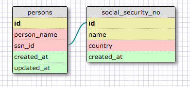
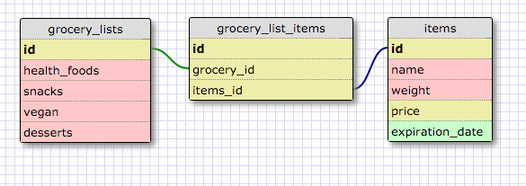

# Release 2: One-to-one Schema

I have two tables, **persons** and **social_security_no**. The government keeps track of many people whom are all unique. Each individual has their own social security number and these numbers never duplicates.

# Release 4: Many-to-many Schema

Each grocery list can have many items that belongs to its category. Each item can belong to more than one grocery list.

# Release 6: Reflect

What is a one-to-one database?
This is where you would have two tables where each row from the first table only coorsponds with only one other row on the second table.

When would you use a one-to-one database? (Think generally, not in terms of the example you created).
When relationships between two tables are uniquely connected with each other. This means that neither table has duplicate since the foreign key would not duplicate.

What is a many-to-many database?
Many to many dbs are often two tables connected by a third table to exhibit their relationship. The first table is connect to many things on the second table and vice versa.

When would you use a many-to-many database? (Think generally, not in terms of the example you created).
This occurs when you would have duplicates from both tables that belongs to the other table.

What is confusing about database schemas? What makes sense?
It's important to think primary key for rows and category for columns when forming the tables. Otherwise, you may trick yourself by naming something too specific for the column name. It makes sense that we draw them out to visualize the relationships between tables of information.